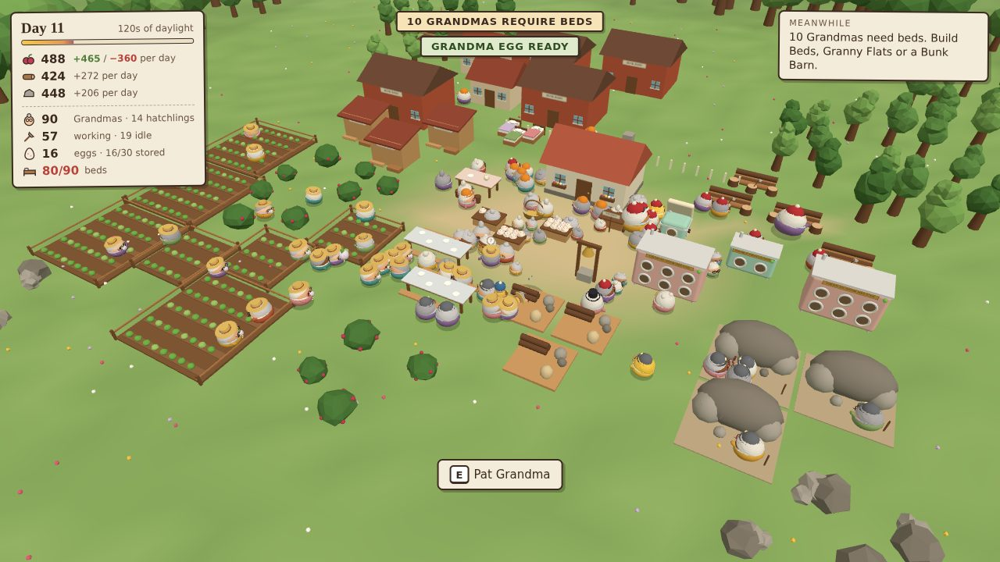

# Too Many Grandmas

*“They keep hatching.”*

A playable 3D HTML prototype of an exponentially growing colony game. You care for one squishy Grandma. She lays an egg. You hatch it in an antique kitchen appliance called the **Gran-ulator**. Soon there are a hundred of them, and they all need feeding, beds and jobs.

The prototype tests one loop: **gather → feed and house → hatch eggs → assign jobs → automate → get overrun.**



## Run it

```bash
npm install
npm run dev          # http://localhost:5173/
```

Production build (static, works from any host or sub-path):

```bash
npm run build        # -> dist/
npm run preview      # http://localhost:4173/
```

## Controls

| Key | Action |
|---|---|
| WASD | move |
| Mouse | look (click the game to capture the mouse) |
| Shift | sprint |
| Wheel | zoom (zoom out to admire the crowd) |
| E / Left mouse | interact (hold for gathering, building, turning the dial, sleeping) |
| Q | remove a worker / put an egg down |
| B | build menu (1–0 select, R rotate, E place) |
| Esc | pause / save / new game |
| F3 | performance readout |

## Tests

```bash
npm test                 # 46 headless simulation unit tests (node:test)
npm run sim -- --check   # balance simulation: bot plays 12 days across seeds and policies
npm run build && npm run test:smoke    # browser smoke test (31 checks, headless Chromium)
npm run build && npm run test:stress   # 50/100/200/300 Grandma performance run
npm run test:all         # everything
```

## Docs

- [Playtest guide](docs/PLAYTEST_GUIDE.md): what to try, URL flags and debug tools
- [Game design](docs/GAME_DESIGN.md)
- [Technical architecture](docs/TECHNICAL_ARCHITECTURE.md)
- [Roblox port notes](docs/ROBLOX_PORT_NOTES.md)
- [Prototype report](docs/PROTOTYPE_REPORT.md): what was built, test results, known issues
- [Screenshots](docs/screenshots/)

## Stack

Three.js and Vite, in plain ES modules with no runtime network dependencies. Audio is synthesised with WebAudio, so there are no sound files. The characters are built from authored primitives, with no image assets.
