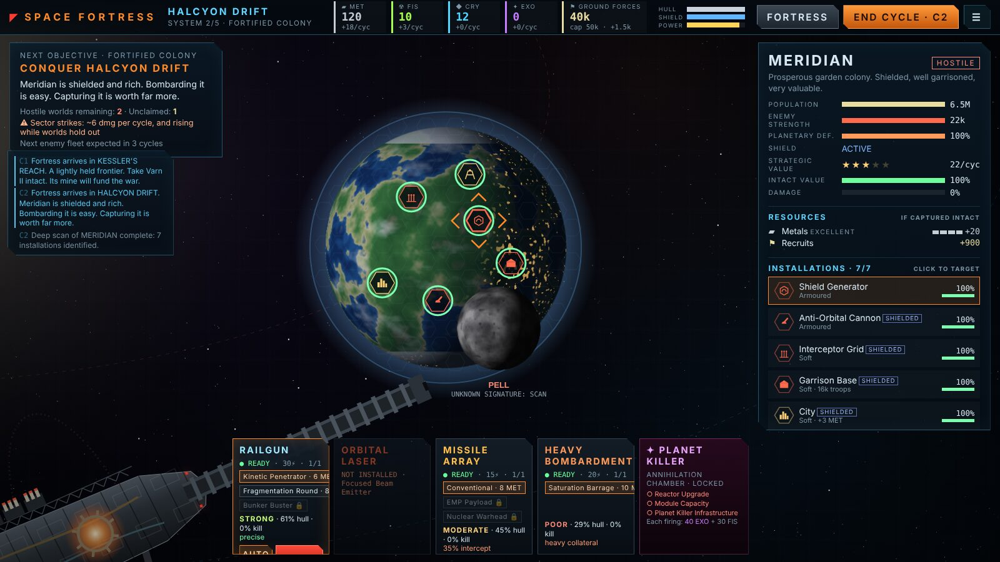

# SPACE FORTRESS

**Orbital-arsenal strategy prototype.** You command a gigantic space weapons platform.
Enter a star system, scan its worlds, decide what you want from each, strip their
defences with enormous weapons, then **invade, capture, or erase** them — and grow
your fortress until you can delete a planet from existence.

The whole game is tension between two truths:

> *I want that world intact… but I also have a weapon that can delete it.*

Precision wins the war richer. Nukes and the Planet Killer win it faster, and poorer.



---

## Run it

It is a single self-contained HTML file — **no build step, no server, no dependencies needed to play.**

```
# Option A: just open the file
open SpaceFortress-Web/dist/SpaceFortress.html        # macOS
xdg-open SpaceFortress-Web/dist/SpaceFortress.html     # Linux
# or drag dist/SpaceFortress.html onto a browser tab
```

```
# Option B: serve it (recommended, so audio autoplay policies behave)
cd SpaceFortress-Web
npx http-server -p 8080 . -o /dist/SpaceFortress.html
```

Developing from source:

```
cd SpaceFortress-Web
node tools/build.mjs     # inlines src/ into dist/SpaceFortress.html
npm test                 # rules-engine unit tests (node --test)
npm run balance          # autoplayer balance report across strategies
node tools/smoke.mjs     # headless browser boot + screenshots (needs Chromium)
```

Target: modern desktop Chrome/Edge/Firefox/Safari, 1366×768 and up. Mouse + keyboard.

### URL parameters (debugging)
`?seed=N` deterministic run · `?sys=N` start already in system N (skips training).
`window.SF` exposes the whole game (`SF.game`, `SF.fire`, `SF.botPlay`, …).

---

## Controls

| Input | Action |
|---|---|
| **Click** a world / moon / fleet | Select it and open its command panel |
| **Click** an installation (on a scanned enemy world, zoomed in) | Target it |
| **Drag** / **scroll** | Pan / zoom the tactical map |
| **1–4** | Select Railgun / Laser / Missiles / Bombardment |
| **F** | Fire selected weapon (opens the manual console for the railgun) |
| **M** | Manual railgun console |
| **Tab** | Cycle enemy worlds |
| **Enter** | End cycle |
| **U** | Fortress Engineering |
| **Esc** | Deselect / back / close |

---

## The loop

```
ENTER SYSTEM → SCAN → read resources + defences → decide what you want
   → strip defences with weapons → INVADE / CAPTURE / DESTROY
   → gain resources → UPGRADE fortress → unlock bigger weapons
   → secure the system → JUMP onward
```

Captured mines pay out **every cycle, forever** — even after you leave. Destroyed mines
pay nothing. Nukes contaminate. The Planet Killer erases everything. The easiest military
solution is usually the worst economic one.

Every cycle you linger, **Sector Command** shells the fortress harder, and enemy fleets
arrive on a schedule — so you cannot solve each world perfectly at leisure.

---

## What's in it

- **5-system campaign** — Frontier → Fortified Colony → Resource System → Enemy Stronghold → the capital, *Aeternum*. Win by taking or erasing the final world; lose if the fortress hull hits zero.
- **4 resources** — Metals, Fissile Material, Energy Crystals, Exotic Matter.
- **4 fortress weapons** + the **Planet Killer** — each with a distinct tactical identity and live effectiveness preview against the selected target.
- **12 installation types** with readable cause-and-effect (kill the shield to expose the surface; kill the barracks to gut the garrison; kill a mine and lose its income forever).
- **Abstract troop invasions** with a live forecast — victory chance, expected losses, capture time — that improves visibly as you destroy defences.
- **Mining economy**, mine upgrades, neutral worlds you can claim without a fight.
- **A tactile manual Railgun console** — a 10-step firing procedure (load, lock, aim, cool, charge, lock solution, release safety, fire) where skill raises damage, guarantees the hit, cuts collateral and can crit.
- **A 12-stage Planet Killer annihilation sequence** — a genuine ceremonial firing ritual.
- **Fortress progression** — six upgrade branches; the station visibly grows modules.
- **Guided tutorial**, autosave, restart, win/lose screens.
- **Procedural everything** — planet spheres, the fortress, screen-space FX and all audio are generated in code. No external assets.

See [`PROTOTYPE_REPORT.md`](PROTOTYPE_REPORT.md) for the full breakdown, balance data and
the state of every system.

---

## Project layout

```
SpaceFortress-Web/
  dist/SpaceFortress.html   ← the playable build (open this)
  src/
    shell.html  style.css
    js/
      core.js data.js        ← constants + campaign data
      sim.js combat.js campaign.js   ← rules engine (pure, Node-testable)
      tutorial.js bot.js      ← tutorial predicates + headless autoplayer
      audio.js art.js fx.js render.js ← procedural presentation
      ui.js ui2.js            ← HUD, panels, modals
      manual.js pk.js         ← the two manual weapon consoles
      main.js                 ← boot, input, loop, saves
  tests/      sim.test.mjs     ← 25 rules-engine tests
  tools/      build / balance / smoke / interact / playthrough / tutorial / shots
  docs/screenshots/
```

The rules engine (`sim/combat/campaign`) has **no DOM dependencies** and is unit-tested
headlessly; the presentation layer is layered on top and never owns game state.
